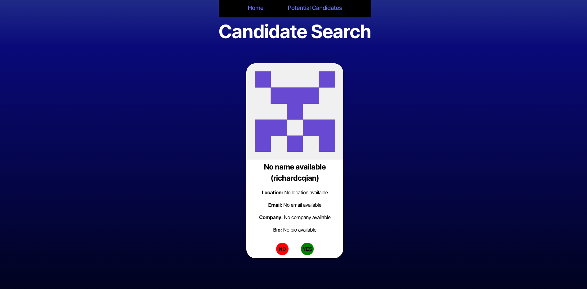

# 13-module-challenge

# Description
This project is a candidate search application. The application searches Github for users. It displays their name, username, bio, and etc. There is a skip of save functionality that stores the list of potential candidates inot another page on the application for further review at a later time. 
## Table of Contents
- [Insallation](#installation)
- [Usage](#usage)
- [Contribution](#contribution)
- [Tests](#tests)
- [Questions](#questions)
## Usage

- <https://github.com/NicMiller35/13-module-challenge>
- 
## Contribution
Nic Miller

## License
This is licensed under <https://opensource.org/licenses/MIT>
## Questions
If you have questions you can reach me at my GitHub or email below.
- <https://github.com/NicMiller35>
- nicmiller13@gmail.com